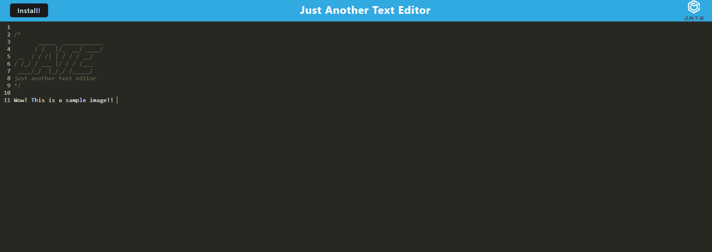

# PWA Text Editor

## Screenshot

## Description
    This Progressive Web Application is a text ediot that runs within the browser, with the option to "install" it to your desktop. It features data persistence, using IndexedDB. 

    The "JATE" branding was based off of this starter code: https://github.com/coding-boot-camp/cautious-meme 

## Usage
    Upon install, navigate to PWA App/PWA-App in the CLI and type in the follow commands:
        - npm install
        - npm run build
        - npm run start
    The application should now be running.

    Alternatively, navigate to the deployed app in Heroku - Link is below.

## Contriutions
    The technologies used within this application are:
    - HTML
    - CSS
    - Javascript
    NPM Packages:
    - Babel
    - Express
    - Nodemon
    - React
    - AWS Webpack 

## Links
    - Github: https://github.com/annapng/PWA-App
    - Deployed app: https://pwa-app-19.herokuapp.com